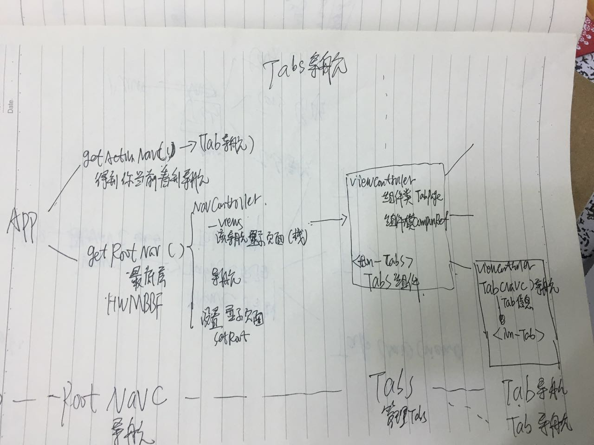
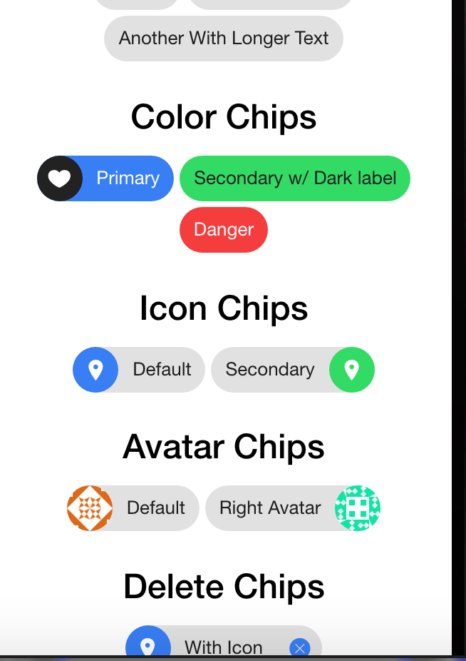

#<div style="text-align:center">ionic2</div>
=======

* APP 结构

	
	
	```
		1:每个页面都是有ViewController 进行显示  注入得到
		2：所有的导航 都是有NavController 进行导航 。Tab(也是实现 NavController)
		
	通过APP结构得到想要的对象
			
	```
* IonicAPP

	```
 	OverlayPortal <-  NavC_Base
	
	_modalPortal: OverlayPortal; modal会在其导航栈中显示
    _overlayPortal: OverlayPortal;
    _loadingPortal: OverlayPortal;
    _toastPortal: OverlayPortal;
    
    
    OverlayPortal为显示组件   但是具备导航功能
	```
* ActionSheetController/ActionSheet
	
	```
		import {ActionSheetController, ActionSheetOptions,ActionSheet} from "ionic-angular"
		注入ActionSheetController
	API:
		创建：
		sheet = this.sheetCon.create({
			title:""
			subTitle:""
			enableBackdropDismiss:bool  点击背景是否消失/默认true
			buttons：[
				{
					text:""
					icon:
					handler:()=>{
						1:点击按钮后触发
						2:返回false 表示不消失 sheet
						3:如果在处理函数中需要做导航子类的过度效果，要注意注 过度效果 执行顺序
						错误:
							sheet.dismiss()
							this.nav.pop()
						正确:
							shet.dismiss().then(()=>{
								this.nav.pop();
							})
						
						
						[return false]
					}
					role:"destructive/cancel"表示按钮类型
				}
			]
		})
	
	ActionSheet
			
		显示
 			sheet.present()=>Promise 是否正常显示
	 	其他：
 			addButton(button: any): void;
 			setTitle(title: string): void;
	 		setSubTitle(subTitle: string): void;
	
	```
* Popover/PopoverController

	```
		pop = this.popC.create(Page,data?,op?)
		
		pop.present({
			ev:event   指定event 以确保能自动识别pop显示的位置
		})
		con(private pop:ViewController){
			pop--> Popover
		}
		其他:
			监听销毁函数..
			内容显示的宽度为200px;
			高度随内容变化 并且底部会有外边距 
			
		
		
	```
	
* AlertController/Alert

	```
		import {Alert,AlertController} from "ionic-angular"
		注入AlertController
AlertController
		alert = this.alertC.crete()
		//或者
		alert = this.alertC.crete({
			title:""
			subtitle:""
			message:""
			enableBackdropDismiss:""
			buttons:[
				{
					text:""
					cssClass:"",
					handler:()=>{
						1:点击按钮后触发
						2:返回false 表示不消失 sheet
						3:如果在处理函数中需要做导航子类的过度效果，要注意注 过度效果 执行顺序
						错误:
							alert.dismiss()
							this.nav.pop()
						正确:
							alert.dismiss().then(()=>{
								this.nav.pop();
							})
						
						
						[return false]
					}
					role:"null/cancel"表示按钮类型
				}
			],
			inputs:[
				type:"text/password/radio/checkbox",
				name:"",
				placeholder:""
				value:"值"
				label:"显示的值"
				checked:"是否默认选择"
				id:"id"
				{
					type:"password",
					placeholder:""
				},{
					type:"radio/checkbox",单选
					value:"apple",
					label:"苹果",
					checked:true
					
				}
			]
		
		})		
Alert
		present(navOptions?: NavOptions): Promise<any>;
		setTitle(title: string): void;
		setSubTitle(subTitle: string): void;
		setMessage(message: string): void;
		addButton(button: any): void;
		addInput(input: AlertInputOptions): void;
	```

* Toast/ToastController 页面中弹出提示

	```
		注入ToastController
		
		toast = this.toastC.create({
			message:""
			position:top/middle/bottom
			duration:ms   一直保持知道 dismiss()
			showCloseButton:bool
			closeButtonText:string
			dismissOnPageChange:bool
		})
		toast.present(..)
		
		tosat. onDidDismiss(func)
		toast.didEnter.subscribe(.)
		
	```
* Badges   消息个数

	```
	<ion-item>
		<ion-icon name="logo-twitter" item-left></ion-icon>
  Followers
  		<ion-badge item-right>260k</ion-badge>
	</ion-item>
	```
	
* button
	
	```
		<button/a ion-button>
			文字 / 图标
		</button>
		
		属性：

			icon-only  仅仅显示icon
			icon-left/right
			'large'   大按钮
			'small'   小按钮
			'default   
			'outline   中空
			'clear':   显示中间内容
			'solid':  
			'round':   圆角
			'block':  占据整行 前后有间隙
			'full':   完全占据整行
			'strong'  
			'mode':   
			"ion-left"
			color="light/secondary/danger..."
		
	```
* Toggle

	```
		<ion-item>
    		<ion-label>Pepperoni</ion-label>
    		<ion-toggle [(ngModel)]="pepperoni"></ion-toggle>
 		</ion-item>
 		
 			check：bool
 			color:
 			disabled:
 			
 			Event:
 				ionChange
	```
*  卡片 card

	```
		ion-card
		ion-card-header
		ion-card-title
		ion-card-content
	```
* ion-spinner

* ion-label
	
	```
			用于ion-item中  配合ion-input, ion-toggle, ion-checkbox,使用
	
	```
*  多选框 checkbox

	```
		<ion-item>
		  <ion-label>Daenerys Targaryen</ion-label>
		  <ion-checkbox color="dark" checked="true"></ion-checkbox>
		</ion-item>
		
		checked: true 表示默认选择
		color:
		disabled:
		mode:
		ionChange:Output Event
	```
* 单选框 ion-radio radio-group
	
	```
		作为input component
		<ion-list radio-group>
			<ion-item>
				<ion-label>A</ion-label>
				<ion-radio checked="bool" value=""></ion-radio>
				<ion-radio [checked]="Func" value=""></ion-radio>
			</ion-item>
		<ion-list>
		
		ion-radio:
			checked:bool
			color
			disabled
			model
			value
			ionSelect：Output Event
		radio-group:
			ionChange：Output Event
			
	```
* Range
	
	```
		<ion-item>
			<ion-range>
				<ion-icon range-left name=""></ion-icon>
			</ion-range>
		</ion-item>
		
		range-left/right   指定左右icon/text
		min/max :最大最小值
		step:100   步长
		snaps:显示刻度 （step/snaps一起使用）
		pin : 表示显示时时刻度指示器
		
		debounce:表示毫秒数 300 防止拖动过快
		disabled：bool
		dualKnobs:显示两个滑块  来选择范围
		
		ionChange:EVENT
		
		
		Range API:
			以上所有属性
			value 当前值   都是整数
			ratio   返回选中的比例/ 如果有两个滑块 返回小的
			ratioUpper:  两个滑块 返回大的那个比例 / 一个返回null
			
			
	```
* ion-chip

	```
		<ion-chip>
			<ion-icon>
			<ion-label>
			<ion-avatar>
			<button ion-button (click)="delete(chip2)">
			    <ion-icon name="close"></ion-icon>
		   </button>
		</ion-chip>
	```
	

* ion-content
	
	```
		@ViewChild(Content) content: Content;
		API：
			contentBottom->number 得到底部被调整的距离  包括页脚
			contentTop：
			
			contentHeight：可视高度
			contentWidth
			
			directionX    return right and left.
			directionY    down and up.
					当前滚动 或者最后的滚动
					
			getContentDimensions()
					滚动所有信息 http://ionicframework.com/docs/v2/api/components/content/Content/
					
			isScrolling()  是否可以滚动
			
			resize() 绘制
					
			scrollHeight（）包含滚动的高度
			
			scrollTo(x, y, duration/300) ->Promise 滚动到
			scrollToBottom(duration)
			scrollToTop(duration)	
		属性：
			fullscreen bool
		Event：
			ionScroll	Emitted on every scroll event.
			ionScrollEnd	Emitted when scrolling ends.
			ionScrollStart	Emitted when the scrolling first starts.
	```
		
* 时间选择

	ion-datetime
	<ion-datetime>
	`<input type="datetime-local">`

	```
	属性
		cancelText:  取消控件的文本
		dayNames:[]  指定显示天的文本
		dayShortNames：[]
		dayValues:string|[]
		disabled:bool
		displayFormat:string 显示时间的格式  YYYY:MM:DD hh:mm:ss
		pickerFormat
		doneText:确定文字
		hourValues:[0,2,4,6,8,19]|"1,3,5,7,9,11"
		max:"2030-1-1" | “2017” "2018-1-1" 指定最大时间 
		min: 只能指定 年月日
		minuteValues:[1,2,3,4,5,6]| "1,2,3,4" 指定显示的分钟的值
		mode:"ios|md|wp"
		
		monthNames
		monthShortNames
		mouthValues
		
		yearValues:[2011,2012] | ",,,"
		
	事件：
		ionCancel
		ionChange
		
		displayFormat  / pickerFormat 任意格式
		[(ngModel)] = 必须 ISO 8601 Datetime Format 
		
	```
*	FABS 提供类似小白点的功能 不能拖动
		
	```
		位置不会随屏幕改变而改变
		<ion-fab bottom right edge> 
			指定白点所在的位置 默认相对父控件 edge表示相对屏幕
			(middle上下  center左右)
    		<button ion-fab mini color="primary"><ion-icon name="home"></ion-icon></button>
    		//mini 表示小圆点
   			<ion-fab-list side="top">
   				//top left bottom right 展开的位置
      			<button ion-fab><ion-icon name="logo-facebook"></ion-icon></button>
      			<button ion-fab><ion-icon name="logo-twitter"></ion-icon></button>
      			<button ion-fab><ion-icon name="logo-vimeo"></ion-icon></button>
      			<button ion-fab><ion-icon name="logo-googleplus"></ion-icon></button>
    		</ion-fab-list>
  		</ion-fab>
	```
	
* Footer  页脚  
	
	```
		1：不属于ion-content
		2：位置浮动的不随content滚动 如有tabs  位于tabs上方
		<ion-content></ion-content>
		<ion-footer>
			<ion-toolbar>
		   		<ion-title>Footer</ion-title>
	  		</ion-toolbar>
		</ion-footer>
		
	```
* Header

	```
		1：不属于ion-content
		2：位置浮动不随content滚动  如有nav  在nav下方
		
		<ion-header>
			<ion-toolbar>
			</ion-toobar>
		</ion-header>
		<ion-content></ion-content>
		
	```
* ion-toolbar

		位于内容上方和下方的工具栏
	
		如果位于ion-header/ion-footer 会固定位置
		
		<ion-toolbar>
			<ion-buttons start>
				<a ion-button>..
			</ion-buttons>
		</ion-toobar>
		
		
* Gestures 手势
	
	```
		tap, press, pan, swipe, rotate, and pinch
		<button (tap)="xxx">
		</button>
	```	
	
* Icon 图标

	```
		<ion-icon>
		name:
		color:
		ios:  在ios 的图标
		md:   在md下的图标
		isActive:bool
		mode:"ios/md、wp"
	```
* ion-img 
		仅仅被用于 virtual-scroll
	```
		<ion-img>
		alt	:string
		bounds:	any
		cache:	boolean
		height:	string
		src	:string
		width:	string
		
		提供缓存 /http请求优化
	```
	
* input
	
	```
	<ion-input>
		clearInput:bool 显示clear按钮
		clearOnEdit：bool  获取焦点清除内容
		disabled:bool 
		max
		min
		mode
		placeholder
		readonly
		step:min  max 步长
		type:password email number search tel url
		value
	Event:
		blur
		focus
	```
* lists

	```
		<ion-list>
			<ion-item *ngFor >
			<div.. ion-item *ngFor > 
		</ion-list>
		
		ion-list:
			no-lines 没有分界线  底部 中部 底部 线
			inset 有内边距


		ion-item-group  组
			ion-item-divider  组头
				ion-item ..
		ion-list-header 表头/尾
		
		ion-item:
		
			item-left/right   表示子控件位置   设置界面
			item-start/end   ltf 的左右
			
			text-wrap  默认会一行显示文字/ 进行换行显示
			子：
				<ion-icon > icon
				<ion-avatar> img</>头像 圆 居中
				<ion-thumbnail></img></ion-thumbnail>   缩略图  占据高度
				< div class='item-note'> 可作为cell说明文本
				<a ion-button item-end>辅助视图</a>
		侧滑:
			<ion-list>
				<ion-item-sliding #slide>
					<ion-item>
					</ion-item>
					<ion-item-options (ionDrag)="A(slide)拖动" side="right" (ionSwipe)="完全打开" icon-left默认在上方>
						<button ion-button color="primary">
				        	<ion-icon name="text"></ion-icon>
				        	Text
				      	</button>
				      .....
					</ion-item-options>
					<ion-item-options side="left">
					</ion-item-options>
				</ion-item-sliding>
				......
			</ion-list>
		说明:
			如果 是button/a  <a ion-item> 那么在ios上会显示右箭头 （detail-none 去掉）（detail-push 增加右箭头）
			
			Checkboxes 默认在左
			Radios and Toggles 默认在右  item-left/righ
		去掉头尾线
			ion-list > .item-block:first-child{
    			border-top: 0 !important;
  			}
			 ion-list >.item-block:last-child{
			    border-bottom: 0 !important;
			 }
		去掉点击背景/更换背景
			ion-item-group .item-ios.activated{
		    	background-color: white !important;
		  	}
		  	ion-item-group a:first-of-type[class*=activated]{
		    	background-color: red !important;
		  }
			
		排序:
			reorder:bool 作用于 list/group
			ionItemReorder :Event 排序触发函数
					更换数据顺序 
					import { reorderArray } from 'ionic-angular';
					hanshu(is){
						this.data= reorderArray(this.data,is)
					}
					或者
					(ionItemReorder)="$event.applyTo(items)"
			
		
	```
* virtualscroll
	
	```
		一个工具 利于优化大量的滚动数据/可不定的高度的cell
		
		<ion-list [virtualScroll]="列表数据"  [headerFn]="myFun">
			<ion-item-divider *virtualHeader="let header(myFun返回值)"></ion-item-divider>
			<ion-item *virtualItem="let oneItem">
			
			</ion-item>
		<ion-list>
		
		1: 提供近似的高度/宽度 以便计算整体
		2：如果ion-item 是自定义的组件 
			最外部用div 包裹 以便以安全的计算高度
			<div *virtualitem="let one;let itemB= bounds"//"#one">
				<my [item]='one'></my>
			</div>
		3:图片 使用<ion-img> 以便内部优化 滚动和加载之间的矛盾
		4:大量数据分组
			[headerFn]="myFun"
			*virtualHeader="let header"
			
			myFun(one,index,all){
				return any
				return null 表示不显示头
			}
			
		virtualScroll
		
		virtualTrackBy	 Fun 返回唯一值 有利于优化
		
	
		
		approxFooterHeight  近似高度 40px
		approxFooterWidth   100%
		
		approxHeaderHeight   40px
		approxHeaderWidth  100%
		
		approxItemHeight   40px
		approxItemWidth   100%
		
		bufferRatio  缓存个数  3  （显示个数+3）
		
		footerFn
		headerFn   
		
	exam:
		<div [virtualScroll]="" approxFooterHeight="100px">
		
		[headerFn]="MyFun"
	
	```
* 上拉加载更多

	```
		<ion-infinite-scroll (ionInfinite)="loadMore($event)" enabled="bool" threshold="100px/15% 表示多少触发">
        	<ion-infinite-scroll-content loadingSpinner="bubbles" loadingText="loading more data"></ion-infinite-scroll-content>
        </ion-infinite-scroll>
    
    loadMore(scroll){
    	加载数据
    	scroll.complete()  完成调用
    	scroll.enable(bool) 是否可用(当没有数据时 fasle)
    }
    
   InfiniteScroll: 
    enabled:bool  是否有效
    threshold:上拉触发触发距离 exam:100px default:15%
	```
* 下拉刷新

	```
		<ion-refresher >
			<ion-refresher-content>
				pullingIcon="arrow-dropdown"
      			pullingText="Pull to refresh"
      			refreshingSpinner="circles"
      			refreshingText="Refreshing..."
			</ion-refresher-content>
		</ion-refresher>
		
		pullMin: 触发最小 default:60
		pullMax: 最大多少触发刷新  min+60
		enabled:bool 是否有效
		closeDuration:280  关闭动画时长
		Out:
			ionStart  开始下拉
			ionPull: 在圈圈出现时刻
			ionRefresh(event): 开始刷新
		
		API:
			cancel()  
			complete（）在你加载数据完成后必须调用
			state
			。。。。
			   
	```
* SeacherBar

	```
		<ion-seacherbar></ion-seacherbar>
		[(ngModel)]="双向绑定"
		
		value:string 值
		placeholder：
		type:text/password/email/number/search/tel/url  def: search
		animation:bool
		autocomplete:string "on"/"off"  补全
		autocorrect："on"/"off" 自动更正
		spellcheck：bool 拼写检查
		color:
		debounce:250 设置间隔 防止触发过快
		
		cancelButtonText：
		showCancelButton：
		
		Event:
			ionBlur 失去焦点
			ionFocus 得到焦点
			ionClear：clear 按钮点击
			ionCancel：cancel 按钮点击
			ionInput ：输入改变
			
		
	```
* Segment/SegmentButton控件

	```
		<ion-segment >
			<ion-segment-button value="js">
				JaveScript
			</ion-segment-button>
			....
		</ion-segment>
		
		ion-segment:
			color:
			disabled:bool
			event:
				ionChange
			[(ngModel)]="选择默认的"
			
		ion-segment-button
			value:
			disabled:
			event:
				ionSelect
		
		联动:
			1:<ion-segment [(ngModel)]="result">				result 对应 ion-segment-button 的值
				根据result的值显示不同内容
			2:（ionChange）="$event"
				
	```
* select/option

  ```
  	<ion-select>
  		<ion-option value="js">JavaScript</ion-option>
  		<ion-option>
  		<ion-option>
  		...
  	</ion-select>
  	
  	ion-select:
  		multiple:bool  表示是否为多选 默认单选
  		okText:string
  		cancalText:string
  		disabled:bool
  		interface:"alert"   action-sheet or alert
  			默认使用alertController形式展示
  		placeholder：文字  当为空的时候
  		selectOptions:{}   创建弹出框的参数
  				{title:"标题",subTitle:""...}
  		Event:
  			ionCancel
  			ionChange
  		[(ngModel)]="选择默认"
  	
  	ion-option
  		disabled:bool
  		selected:bool是否选中
  		value
  		
  		Event:
  			ionSelect
  			
  	如果位于表单必须声明name
  		
  ```
* Slides

	```
		<ion-slides>
			<ion-slide>
			</ion-slide>
			.....
		</ion-slides>
		
		ion-slides:
			loop:是否连续
			autoplay:number 是否自动播放 并设置间隔时间
			speed：300   过度动画时间
			direction:滑动方向vertical"/"horizontal"
			effect:翻页效果slide, fade, cube, coverflow or flip. Default: slide.
			initialSlide:number 初始页
			spaceBetween:两个side之间的位置间距
			pager:bool 显示分页
			paginationType：bullets, fraction, progress. Default: bullets  分页标示
			zoom：bool 是否可以zoom
			control:[slide]
			
			Event：
				ionSlideAutoplay  当slide 在移动
				ionSlideAutoplayStart
				ionSlideAutoplayStop   自动播放开始结束 
				ionSlideWillChange
				ionSlideDidChange   改变结束
				
				ionSlideTap
				ionSlideDoubleTap
				ionSlideDrag      用户单击/双击/拖拽slide
				
				ionSlideNextStart
				ionSlideNextEnd    开始/结束到下一张
				
				ionSlidePrevStart
				ionSlidePrevEnd   开始结束到前一张
				
				ionSlideReachEnd 到达最后一张
				ionSlideReachStart到达指定的初始页
				
		Slides:
			enableKeyboardControl(bool)
			getActiveIndex()得到当前第几张
			getPreviousIndex()得到之前的位置
			isBeginning()是否在初始位置
			isEnd() 是否在最后一张
			length()  多少张
			lockSwipeToNext()  开启/关闭 到达下一张
			lockSwipeToPrev()  开启/关闭 到达上一张
			lockSwipes()      开启关闭 滑动
			
			slideNext(speed？, runCallbacks?)
					到达下一张 动画事件  是否通知 ionWillChange/ionDidChange events. 
			slidePrev(speed？, runCallbacks？)
			slideTo(index, speed, runCallbacks)
			
			startAutoplay()
			stopAutoplay()
			update()  在改变slide个数后调用
			
	问题:
		1:在slide加入图片后 图片设置100% 后无效 依然会超出父视图
			解决： ionic会为每个slide生成一个div class="slide-zoom"   修改该class  使其 高度宽度为100%
		2:ion-slide 内容默认是上下左右居中显示
		3:创建应用导航界面  替换MyApp  rootPage属性即可
		4:如果设置<ion-slides autoplay=""> 数据是通过网络得到 
			会有错误:Cannot read property 'hasAttribute' of undefined
			解决:初始datas=[];
				不设置autoplay的Input 在数据得到之后手动设置
				在短暂延迟后
					autoplay=""
					startAutoplay()
		5:得到的当前激活的index（getActiveIndex）不对
			0,1,2  得到的却是   2,0,1,2,0
			
	```
	
* Loading
	
	```
		imports {Loading,LoadingController} from "ionic-angular"
		等待窗口
		let load = this.loadC.create({
	 		spinner?: string;
		   content?: string;  html
    		cssClass?: string;
    		showBackdrop?: boolean;
    		dismissOnPageChange?: boolean;
    		delay?: number;
    		duration?: number;
		})
			
	Loading:
		present()
		dismissAll()
		dismiss()
	``` 
	
* 侧滑栏menu
	
	```
		把当前需要显示在侧栏内容区域的组件作为[content]="AA"
		<ion-nav [root]="rootpage" #rootContent></ion-nav>
		<ion-menu [content]="rootContent">
			<ion-content>
				侧栏
			</ion-content>
		</ion-menu>
		
		side:""  侧栏所在侧边
		type:""  如何显示侧栏内容 
				“overlay” window默认 内容不移动 出现遮盖物
				“reveal”   ios默认
				“push”
		enabled:bool  指定是否可用 也可用作多个side 选择性激活
		persistent: bool可持续性的 
					  默认ion-nav 的mentToggle只会出现在root界面
					  true表示在子界面也显示该menuToggle
		id:  用于标示一侧多个menu
		swipeEnabled:是否可以侧滑打开
		
				
		menuToggle: 显修饰button 的指令
					menuToggle="right" 
		menuClose :关闭侧栏 ； ="left" 关闭左侧侧栏
		注意:
			if menutoggle 在导航栏 那么该按钮只会在root页面显示
	
		MenuController
			:直接注入该provider
			:如果只有一个menu 不需要做任何配置
			:左右各一个 默认得到的是左侧的一个 在任何操作是加入参数"right/left"
			:在root 下有多个menu
				<ion-menu id="AA" side="left">
				<ion-menu id="BB" side="left">
				<ion-nav #mycontent [root]="rootPage">
			选择激活的menu  在进行后续操作
				this.menuC.enable(bool,"ID")
			
		API：
			close(id?)
			enable(bool,id)
			get(id?)  得到menu
			getMenus() menus
			getOpen() 得打打开的那个
			isEnabled(id?)  是否是激活的
			isOpen(id?)   是否是打开的
			open(id?)
			toggle(id?)  开启/关闭
			swipeEnable(bool,id?) 设置是否开启
		
		EVENT:
			ionClose
			ionDrag
			ionOpen
	
	```	
* Modal/ModalController

	```
		1:创建Modal 文件 (模态弹出的内容/组件)
		2:创建Modal窗口 对象 modalObj = this.modal.create(组件,{传递对象必须为对象})
		3: 显示 modalObj=present()
		4: 内容组件 本身不是ViewController 但是她在一个ViewController(Modal) 中显示
			组件:注入当前ViewController 来控制窗口
			
		5:参数
			参数传递 create(组件,obj)| NavParams 得到参数
			参数回调 modalObj.onDidDismiss(func) | dismiss(data)
			
			
		
	```
	
* tabs/tab  -->Tabs Tab导航

	```
		<ion-tabs>
			<ion-tab></ion-tab>
			<ion-tab></ion-tab>
			<ion-tab></ion-tab>
		</ion-tabs>	
		
		ion-tabs:
			color:
			mode:
			selectedIndex:number 默认选择的
			tabsHighlight：  当被选择 高亮
			tabsLayout：icon-top, icon-left, icon-right, icon-bottom, icon-hide, title-hide. 布局
			tabsPlacement：top、bottom
			Event:
				ionChange
				
		ion-tab:
			[root]:根页面
			[rootParams]:{}  有tabs 传递给root页面
			enabled:bool  不可点击
			show:    是否显示
			swipeBackEnabled：是否可以滑动返回
			
			tabBadge：string 
			tabBadgeStyle:string color
			
			tabIcon:string
			tabTitle:string
			tabsHideOnSubPages:是否隐藏tabs  在子视图中
			
			Event：
				ionSelect 点击事件
	```
 
* ion-nav / ion-navbar /NavigationContainer/ NavControllerBase /NavController / Nav/ NavParams参数
* 页面的生命周期 | App导航

	```
	关系：NavigationContainer > NavController-> NavControllerBase-> Nav
	定义导航抽象方法
			NavigationContainer > NavController  
	
	导航组件（实现了导航抽象方法）
			NavControllerBase
			Nav/OverlayPortal
			
	
	<ion-nav> 创建导航 创建导航栈 NavController
		[root]属性指定具体显示的内容组件
			
	
	如果想使用导航栏作为导航器
		1：使用<ion-navbar> 并且注入NavController
		2：默认在下一个导航栏增加返回按钮(如果没有可以使用代码 返回
		)
	如果你要在App组件中使用导航 你不能注入NavController(App组件是最大的 其他都是其子组件)
		使用模板引用 ion-nav 在进行导航
		
	指令导航:
		<button navPop >
		<button [navPush]="Page" [navParams]="{id:,name:}">
	代码导航：
		(private navC:NavController)导航对象
		.push/pop/setRoot..
		
	API：
		ion-nav / Nav 
			NavControllerBase 作为 RootNav
			root 
			swipeBackEnabled：bool 是否可以滑动回去
			
		ion-navbar / Navbar
			1:包含一个ion-title 和多个 ion-buttons
			2:必须在ion-header中
			3:ion-nabbar 是动态的 （如果需要静态的 使用ion-toolbar）
			navCtrl 得到导航控制器
			setBackButtonText（st） 设置返回文字
			hideBackButton：bool  
		
		NavController 接口 只是控制着导航栈 和 动作
		NavControllerBase ims NavController 实际对象
		
		生命周期事件（函数）:（该事件可以定义在任何组件 但是仅仅回调在导航期间 ）
			ionViewDidLoad
			ionViewWillEnter
			ionViewDidEnter
			ionViewWillLeave
			ionViewDidLeave
			ionViewWillUnload
			ionViewCanEnter   return bool /Promise<void>
			ionViewCanLeave   return bool /Promise<void>
				是否可以进入/退出 --> 捕捉navCtrl.push
			任何通过导航控制器导航的组件都有该生命周期函数
			
		生命周期事件流 （属性）：
			viewDidLoad: EventEmitter<any>;
			viewWillEnter: EventEmitter<any>;
			viewDidEnter: EventEmitter<any>;
			viewWillLeave: EventEmitter<any>;
			viewDidLeave: EventEmitter<any>;
			viewWillUnload: EventEmitter<any>;	
			
			API:
				push(Page,pars,{})
					animate:bool 是否动画
					animation:[md-transition, ios-transition and wp-transition.]
					direction:方向
					duration：周期
					easing：时间函数
				pop(opts)  返回上一个
				popToRoot(opts) 回到根VC
				
				canGoBack() 是否可以返回
				canSwipeBack() 是否可以侧滑返回
				
				 first() 返回占第一个ViewController
				 last()
				 getActive() 得到激活的
				 getByIndex(index) 得到第几个ViewController
				 getPrevious(vc)    得到上一个ViewC
				 getViews() 所有
				 length()   多少个
				 indexOf(view)
				 insert(insertIndex, page, params, opts) 插入 ViewController
				 insertPages(insertIndex, insertPages, opts)
				 setPages(pages, opts) 设置Pages 并导航到最后一个
				 setRoot(page, params, opts) 
				 	吧当前页设置为root 替换当前栈 最底下页面
				 remove(startIndex, removeCount, opts)移除
				 removeView(viewController, opts)
				 
				 isActive(view)  ViewC 是否是激活的
				 
				 getActiveChildNav()
				 parent（）  得到父亲
				 	rootnav->null
				 	Tab->tabs
				 	.. -> nav
				
				可观察：
					viewDidEnter
					viewDidLeave
					viewDidLoad
					viewWillEnter
					viewWillLeave
					viewWillUnload
					
		NavParams 服务获取导航参数：
			获取push(pars)参数  this.params.get(name)
		NavController注入
			1:在rootComponent 不能注入该服务 
			2:可以通过<ion-nav #myNav>得到@ViewChild('myNav') nav: NavController
			
		设置统一导航栏样式:返回按钮
			IonicModule.forRoot(SmartSpace,{
		      backButtonText:"",
		      backButtonIcon:"md-arrow-round-back"
	      }),
	   隐藏返回按钮：
	   		1：ViewController.showBackButton()
	   		2:<ion-navbar hideBackButton='true'>
			
		
	```
* Tab 继承 NavControllerBase | Tabs 组件

	```
		Tabs组件管理
		Tab 导航对象
	```
* ViewController

	```
	所有以页面显示呈现出现的都是继承它 (Modal,Loading,ActionSheet...自定义)
		willEnter
		didEnter
		willLeave
		didLeave
		willUnload
			属性,为生命周期 return 可观察对象；  订阅它就可以得到回调
		index
			处于nav栈的位置
			
		onDidDismiss(callback: Function): void;
		onWillDismiss(callback: Function): void;
			生命周期回调
			
		dismiss(data?: any, role?: any, navOptions?: NavOptions): Promise<any>;
			手动dismiss 传递参数等等。。
			。
		
			
		isFirst(): boolean;
		isLast(): boolean;
			栈位置
		
		pageRef(): ElementRef;
		getContent(): any;  得到Content引用
		contentRef(): ElementRef;
		
		setBackButtonText(val: string): void;
			返回按钮字体
	    showBackButton(shouldShow: boolean): void;
	    	//是否显示返回按钮

		enableBack(): boolean;
			是否可以返回 
		hasNavbar(): boolean;
		
	* 页面传值
		* 父 到 子 NavC.push(page,data)
		
		* 子 到  父
			NavC.push(page).then(()=>{
				NavC.last().onWillDismiss((data)=>{
					回传的数据
				})
			})
			viewC.dismiss(data) 使用这个进行返回 不是有 nav.pop()
			
			////
			传递一个函数 在子界面进行调用
			AAA(pars){
		    return new Promise((resolve,reject)=>{
        		console.log(pars)
	          resolve("ok")
      			// reject("error")
		    })
		    
		    this.nav.push(Page, {callback:this.AAA})
		
	```	


* 通知系统

	```
		Events
		
		1:订阅
			this.events.subscribe(name,func)
		2:退订
			this.events. unsubscribe(name,func)
		3:通知 
			this.events.publish(name,data:any)
	```
* Haptic

* DeepLinker  实现指定页面URL
	
	```
	forRoot(A,{},{links:[]})
	
		ionic2 无路由  
			URL:http://www.localhost:3000   不会改变
		都是在一个单页面中进行导航 并记录导航栈
		
		但是有些情况下需要用到URL来进行路由跳转 这就是DeepLinker的作用  
		默认历史：
			[{component:TbasPage,name:"tabs",segment:"tabs:/id", defaultHistory:[Page.]}]		
			当导航栈中没有 会默认使用defaultHistory
		exam:
			1:启动应用到达某个子界面
				{
					links:[
					{ component: IntroductionPage, name: 'aa', segment: 'aa',defaultHistory:[TabsPage] }
					]
				}
				启动应用http://localhost:8100/#/aa/aa    (到达IntroductionPage) 
				这时的返回按钮会回到TabsPage界面
				
			2:通过URL指定到达的tabs
				{
					links:[
						{component:TabsPage,name:"tabs",segment:"tabs/:index"},
					]
				}
				启动应用:http://localhost:8100/#/tabs/2
				
				NavParams->index
				<ion-tabs selectedIndex="{{selindex}}">
				
			说明:这样会直接到达指定页面，如果你设置了应用启动广告页面 或者Icon 页面  会和其产生冲突
			let hash:string = window.location.hash;
    			if(!(hash.indexOf("#/")==0 && hash.length>2)){
      				this.showIconAndAdPage();
    		}
			
	```
	
* APP 配置 Config对象
	
	```
		IonicModule.forRoot(MyApp,{
			activator:string "ripple", "highlight"改变按钮样式
			actionSheetEnter
			actionSheetLeave   Sheet 出现消息的动画名称
			
			alertEnter
			alertLeave       Alert 出现消息的动画名称
			
			backButtonText   返回按钮
			backButtonIcon    
			
			loadingEnter
			loadingLeave
			
			modalEnter
			modalLeave
			
			pickerEnter
			pickerLeave
			
			popoverEnter
			popoverLeave
			
			toastEnter
			toastLeave
			
			iconMode：ios/md  指定icon 的样式
			
			mode  :ios、md,   设置默认mode 整个App
			
			pageTransition:   指明页面过度动画
			
			spinner:指定默认的使用样式
			
			swipeBackEnabled:是否可以侧滑返回  ios 默认为true
			
			tabsHighlight :bool  选择的是否高亮
			tabsLayout："icon-top", "icon-left", "icon-right", "icon-bottom", "icon-hide", "title-hide".
			
			tabsPlacement："top", "bottom"
			tabsHideOnSubPages：bool
			
			1：以上的属性都可以对设备分开配置
				platforms:{
					ios:{
						
					}
					...
				}
			2：以上属性都是全局设置 你可以在具体位置做  个性化修改
		})
		
		config
			get(key , defaultV?)
			getBoolean(key,defaultV?)  有值 return true 默认false
			getNumber(key, defaultV?)
			set(platform, key, value)
				set("ios","key","value")
			
			可以进行config参数获取  
			也可以进行值得传递
				config.set("ios","name","China")
				config.get("name") if iosApp return China
	```
* APP  服务

	```
		getActiveNav() 得到你现在看到的Nav
		getRootNav() rootNavC
		isScrolling() APP是否可以访问
		setTitle(val)  Document title
		
		viewDidEnter(O Observable) 在任何导航调用
		viewDidLeave
		viewDidLoad
		viewWillEnter
		viewWillEnter
		viewWillUnloads
	```
* Platform   
	
	```
		1：dir() / setDir(dir) 得到html 配置
			<html lang="en" dir="ltr">
		2：isRTL()   bool  是否右到左的排版
		3: height()/width()   window.innerWidth
		4:is(platformName)  
			android	on a device running Android.
			cordova	on a device running Cordova.
			core	on a desktop device.
			ios	on a device running iOS.
			ipad	on an iPad device.
			iphone	on an iPhone device.
			mobile	on a mobile device.
			mobileweb	in a browser on a mobile device.
			phablet	on a phablet device.
			tablet	on a tablet device.
			windows	on a device running Windows.
		5:platforms()
		
		6:isLandscape()/isPortrait()
		7:lang()  / setLang(language,reload?)
					 en-US, en-GB, ar, de, zh, es-MX...
		8:ready().then(func)
		9:url()
		10:versions()
		11: registerBackButtonAction(callback, 优先级)
			注册返回按钮事件  （硬件返回，ios不支持）
		12: pause/resume  .then(...)
				在硬件设备上  进入前后台触发
	```

* IonicErrorHandler错误处理

	1:编写自己的错误	
		```
			class MyError implements ErrorHandler{}
		```
		
	2:替换angular错误处理
		```
			@NgModule({
				providers:[{provide: ErrorHandler, useClass: MyError}]
			})	
		```
* 键盘 Keyboard
	
	```
		注入Keyboard
		
		close()
		isOpen()
		onClose(func)
	```
* 网格系统 基于flex

	[AA](http://ionicframework.com/docs/theming/responsive-grid/)
	
	```
	ion-grid / ion-row /ion-col  也可作为指令（<div ion-row>）
	A:
		1:网格默认占据整行
		2:行的子类只能为列  列才能包含内容
		3:列是默认平分整行 col-sm ***
		4:列默认被分为12等分   col-4 / col-2 / col-6  4：2：6 平分
		5：列是百分比比分  父级必须有宽度
		6: 列默认有padding  5px  no-padding 去掉
	B:
		1:网格属性
			
		2:行属性(高度由内容支持  也可以设置)
			
			justify-content: 列在主轴的排列方式
			align-items: 定义列在交叉轴（y）排列方式
			flex-wrap  ： 换行方式
		3:列属性
			align-self ： 单个item 在行上的对齐方式
	C:
		xs   auto         100%
		sm   540px        576px
		md   720px        768px
		lg	  960px        992px
		xl   1140px       1200px
		用在grid上  表示如果 screen 1200px  ; grid为1140px
		
	D: 断点
		xs   0    
		sm   576px
		md   768px
		lg	  992px
		xl   1200px
		
		第一个断点必须是0  ;  多个必须是升序
		exam:
			col-sm  (col-sm-0)		
			col-sm-3     (col-sm-    3平分比例)
			offset-sm-3
			push-sm-3
			pull-sm-3
		
			offset-sm-3
				表示只有在screen >= sm 时  才触发
				
	F:所有可用
		col- 1
		col-auto
		col-100
		col-sm-1
		
		offset-1
		offset-sm-1
		
		push-1
		pull-1
		
	G:可以通过配置修改 上面的配置
		> 修改 默认平分12 
		> sm ...的值
		> 间距
	```
* 主题
	
	```
	用于配置颜色为整个应用  src/theme/variables.scss
		$colors: (
		  primary:    #387ef5,
		  secondary:  #32db64,
		  danger:     #f53d3d,
		  light:      #f4f4f4,
		  dark:       #222,
		  配置属于你的主题
		  zzh:(base:字体颜色，contrast:背景)
		  zm:#4a2143
	   );
		
		color="zzh"
		
		获取：
			.div{
				background-color:color($colors,zzh,base)
			}
	
	定义全局变量 css
		$my-height:40px
		.a{
			height:$my-height
		}
		.b{
			height:$my-height
		}
	全局属性指令
		上
	全局模式:
		ios/wp/md
		系统会根据当前环境 使用自动的mode 但是你可以修改
			全局:<ion-app class="md">
			某个组件: <ion-button mode='md'>
	重写样式
		如果你对ionic 提供的某些样式不满意 可以重写
		在 theme/variables.scss 
		// Shared Variables  
		 $text-color: #000099;
		可重写：
			http://ionicframework.com/docs/v2/theming/overriding-ionic-variables/
	
	针对平台修改样式
		1:默认的系统样式（可以在调试中得到得到class名称）
			<ion-input> 下的input标签
				.text-input     公共
				.text-input-ios ios平台
				.text-input-md  安卓平台
			.text-input-ios{覆盖增加样式}
			
	  		覆盖某个组件
		 		ion-input 标签
					.input-md{background-color: #2ec95c;}
					.input-ios{} // .ios .input{}
	  	2:
			
	```
*  注意

	```
		ionic 中View/ViewController 是一个整体
		
		1:这个工程的所有导航都是基于 NavController
		2:所有显示的窗口都是通过ViewController
		3:ionic2    无路由概览	
		4： 任何组件都有该可配置属性 来控制主题和状态
			color:
			mode:
	```
* 功能实现
	* 导航栏
		
		```
			<ion-header>
				<ion-navbar>
					<ion-buttons left="">
						<a ion-buttion padding>
							ion-icon
						</a>
						<a ion-buttion menuToggle>
							menuToggle会导致不能多个并排
						</a>
					</ion-buttons>
					ion-title  标题
				
				</ion-navbar>
			</ion-header>
		```

	* 窗口设置
		
		```
			1:<ion-nav [root]="XX"  #hNav>
				设置 root的值
			2:<ion-tab [root]="tab0"></ion-tab>
				设置 root的值
			3:设置导航栏窗口
				this.app.getRootNav().setRoot()
		```
	
	* app导航页
		
		```
			1:创建导航页welcome.html
			2:在app.component.ts 
				判断是否实现导航页 rootPage=xx/oo
			3:在显示导航页之后
				存储已经显示 Storage
				_app.getRootNav().setRoot(Page)
				
		```
	* 广告页
		
		```
			1:创建导航页ad.html
			2:在app.component.ts 
				判断是否显示广告页 rootPage=xx/oo
			3:在显示广告后
				_app.getRootNav().setRoot(Page)
		```
	* 导入第三方JS  （ typing 支持的库  /   不支持 ）
	
		```
		* typing库
			* 安装库 npm install jquery
			* 安装定义文件 npm install @types/jquery --save
			* import * as $ from 'jquery';
			* $('body').addClass('');
			
		* 自己的库js A
			* 导入文件在assets下
			* index.html 下导入<script src="/assets/jquery.min.js"></script> 
			* ts declare var $: any; || xxx.d.ts中申明

		```
	* 表单
		
			所有表单控件必须声明name属性  
			
	* APP启动到指定页面  

			DeepLinks
			
	* 技巧
		
		```
			debugger; 加入代码 进行调试
			首先 ：xcode编译通过
			
			 $ionic cordova platform add ios
			 $ionic cordova build ios
			 $ ionic cordova emulate ios -lc 模拟器时时调试
			 $ionic cordova run android -l -c
		```
		
	* 国际化

		```
			1:npm install ng2-translate --save
			2:import { TranslateModule,TranslateLoader ,TranslateStaticLoader} from "ng2-translate/ng2-translate"
			3:
				imports: [
    				  TranslateModule.forRoot({
				     	 provide:TranslateLoader,
     			      	 useFactory:(http:Http)=>{return new TranslateStaticLoader(http,"assets/i18n",".json")},
					  	 deps:[Http]
   					  }),IonicModule.forRoot()
			   ]
			4:在www/assets 创建文件夹i18n  并在下创建对应语言的json国际化文件  (zh.json/en.json)
			5:MyApp  
				import { TranslateService } from "ng2-translate/ng2-translate"
				/**在获取不到的时候  使用的语言*/
				this.serve. setDefaultLang("zh");
				/**当前使用的语言*/
				this.serve.use("en")  
			6: 使用
				{
					A."HELLO":"<a>AA</a>"
					使用:
						<div>{{"HELLO" | translate}}</div>
						<div translate >HELLO</div>
						<div [innerHTML]="'HELLO' | translate" ></div>
						
					B."HOME":{
						"TITLE":"这是标题"
					}
					使用:
						为不同环境下同一词 对应不同意思
						<div>{{'HOME.TITLE'|translate}}</div>
						<div translate>HOME.TITLE</div>
					
					C."HOME":{
						"TITLE":"hello {{value}}"
					}
					使用:
						使用参数
						<div>{{'HOME.TITLE'|translate:pars}}</div>
						<div translate [translateParams]="pars">HOME.HELLO</div>
						
				}
				
			7:API  TranslateService
				1:ser.setDefaultLang("") 被用 在当前语言没有得到值时
				2:ser.getDefaultLang() 获取默认言语
				3:use("lang")->Observable   设置当前语言/改变语言
				4:currentLang         得到当前语言
				5:getBrowserCultureLang() 得到当前浏览器语言
				  getBrowserLang()
				6:set(key:str,key:str,lang:str?)  得到翻译
				  get(key:str|[str],par:any)->Observable  设置翻译
				7:getTranslation(lang: string): Observable<any>得到当前翻译对象（json）
				  setTranslation
				8:getLangs()  addLangs   得到/设置 语言
				9:reloadLang("") 
				  resetLang("")
				  
			8:事件
				onTranslationChange  翻译对象改变
				onLangChange         语言改变
				onDefaultLangChange  默认语言改变
				
				this.tranSer.onDefaultLangChange.subscribe(()=>{
				})
				
				
		```
	* ionic 组件 / 管道 / 指令 /服务 / 页面
		
		```
			Component --->  declarations:[]组件
			Pipe      --->  declarations:[]管道
			Directive --->  declarations:[]指令
			Injectable -->  providers:[]   服务
			
			页面Component --> declarations:[]
								 entryComponents:[]
			
			
			@NgModule({
				declarations:[
					申明你所有组件（页面,自定义组件）
				]
				bootstrap: [IonicApp],
				entryComponents: [
					配置需要动态创建显示的插件
					一般所有组件都是动态生成插入的
				]
				imports: [
				    IonicModule.forRoot(MyApp,{}
				    ionic 信息配置
				]
				providers:[申明全局服务]
			})
		```
	* 事件延迟
	
		```
			除了 button a 点击没有延迟
			其他元素 <tag (click)="" tappable> 会有300ms延迟
			tappable移除延迟
			《a tappable (click)="aaa"》
		```
	*  单利
	
		```
			class A{
				private static single:A= new A();
				...属性
				...方法
				constructor(){
					if(A.single){throw new Error("");}
					A.single=this;
				}
				public static GetInstance():A{
					return A.single;
				}
			}
		```
	* ionic 移动端适配

		```
		说明:虽然和完全前段网页一样都是全网页 但ionic 是针对app编程 （ 前者处理ipad 也就仅仅显示电脑页面   但是 ionic 无论重何总设备打开 都是以app形式呈现）
		
			> ionic 默认为 缩放比例  1:1
			> ionic html字体带下为 16 * 62.5% = 10px(1rem)
				chrome 浏览器最小字体 12px 所以会显示12px
				又如标题 1.7rem  = 10*1.7  = 17px
				系统默认 无需修改
			> ionic 字体(ios / md  1.4rem  默认14px)
				>系统默认的控件都有独特的字体大小
				>所有标签都是14px（1.4rem）  除了 h1..之类的标签
				所以这里字体是适配的
			>  间距 使用px 距离屏幕边缘大小 元素间隔 
			>	元素大小 一般有两套UI{
					1:iphone
					2:ipad
				}
					>一般的头像 固定像素
					>文本 流水布局/ 固定宽高
					>图片展示  间距固定 比例屏幕（网格布局）
			
			> 使用网格布局  适用不同屏幕
	```
	*  跨域解决
		* ioinc serve / ionic cordova run ios -l		会在本地开启一个服务 导致请求外部资源存在跨域问题
		* 
			 ```
			 	ionic.config.json 加入
			 	
					"proxies": [
						{
					      "path": "/apiv1",
					      "proxyUrl": "http://ah.vr68.com/apiv1"
    					}
				 	 ]
				 	1: 如果你需要访问 http://ah.vr68.com/apiv1/getCode
				 	2:现在你仅仅需要 访问 /apiv1/getCode 此时你就会访问 http://local.8100/apiv1/getCode
				 	3.该配置 会把 local主机 自动 代理到http://ah.vr68.com/apiv1/getCode
				 	4.该配置打包后无效
			 ```
 
		* 打包后 </br>
			使用 UIWebView加载 file://访问本地资源 不存在Cors</br>
			最新的默认为WKWebView 存在Cors

		* 解决路径 （dome：切换问题）
		
			```
			@Injectable()
export class URLFactory{
  private BaseURl:string;
  constructor(private plat:Platform){
    this.BaseURl = plat.url();
  }
  URL(content:string):string{
    if(this.BaseURl.indexOf("file://") >=0 ){
      //UIWevView 打包之后
      return  "http://ah.vr68.com/apiv1/" + content;
    }else if(this.BaseURl.indexOf("localhost:8080") >= 0){
      //WKWebView 打包之后
      /**
       *  针对WKWebView 这里没做处理  还是存在Cors问题
       *  请阅读ionic WkWebView说明
       * */
      console.log("针对WKWebView 这里没做处理  还是存在Cors问题 \r 请阅读ionic WkWebView说明");
      return  "http://ah.vr68.com/apiv1/" + content; 
    }else{
      //远程 或者 远程真机调试
      //设置代理
      return "/apiv1/" + content;
    }
  }
}
			```
	* WKWebView  [!AA](http://ionicframework.com/docs/wkwebview/)
	
		```
		1:最新的框架 默认使用的是WKWebView
		2:使用该插件作为解析的容器  存在CORS问题 本地有个localhist服务 所以存在CORS
		3:还有很多问题 和 优点(速度 内存)
		问题:
			1:存在加载file://文件开头的资源错误
				file:///asas/a.png -> /asas/a.png
				import { normalizeURL } from 'ionic-angular';解决路径问题
				
			    Core cordova 记载某些资源使用 cdvfile:// 
			    
				takePhoto() {
					 this.camera.getPicture().then((img)=>{
					    this.imagePath = normalizeURL(img);
				 	 })
				}
			2:在现有工程上如何升级到 WKWebView 
				ionic cordova plugin add cordova-plugin-ionic-webview --save
				https://github.com/ionic-team/cordova-plugin-ionic-webview#installation-instructions
			3：如何降级 使用 UIWebView
				方式1:config.xml 强制使用UIWEBVIEW
					替换<preference name="CordovaWebViewEngine" value="CDVWKWebViewEngine" />
					为<preference name="CordovaWebViewEngine" value="CDVUIWebViewEngine" />
				方式2:移除WKWebView 插件
					ionic cordova plugin remove cordova cordova-plugin-ionic-webview --save
					rm -rf platforms/
					rm -rf plugins/
					ionic cordova build ios
				
			4:升级 降级 数据问题
				使用ionic-storage  保证数据公用
			5:白屏
				A:可以清除工程 再次编译
				B:<allow-navigation href="http://localhost:8080/*"/>
				C:<feature name="CDVWKWebViewEngine">
					  <param name="ios-package" value="CDVWKWebViewEngine" />
		    		</feature>
				 <preference name="CordovaWebViewEngine" value="CDVWKWebViewEngine" />
			6:本地资源  （随他 css 等一起打包的）
				使用 1 的方式
				
			7：WKWebView AVAudioSession问题
				> WKWebView和APP 不共享 同一 AVAudioSession
				> 设置为共享
					OC:[[AVAudioSession sharedInstance] setCategory:AVAudioSessionCategoryPlayAndRecord 
                                 withOptions:AVAudioSessionCategoryOptionMixWithOthers
                                       error:&error];
               		或config:<preference name="AudioCanMix" value="true" />
	          8:CORS 问题
   		       	1:使用UIWebView
       		   	2:服务器容许 跨域
          		3:使用 cordova-plugin-http插件 来进行网络请求
				
		```
	* Tabs 自定义
	
		```
		自定义Tabs图片
		  在网页下可见
			在页面中研究可以看到在ios上有两个类是
			.ion-ios-homeImg   和  .ion-ios-homeImg-outline
			第一个是选中的状态，第二个是未选中的状态
			而在android上只有一个类　.ion-md-homeImg
			
		http://blog.giscafer.com/2017/06/27/ionic3-tab-custom-icon/ 实现
		
		```		
	* ionic ion-list 滚动问题
	
		```
			ion-list 在模型嵌套下无法滚动
				1：推荐 在外部包含ion-content 该控件会100% 100% 填充整个父标签
				2: 也可以嵌套div overflow-y: auto;达到可以滚动效果
				
			滚动条：
				overflow-x/y: hidden/scroll/auto;
				margin-right: -15px; margin-bottom: -15px; 达到隐藏滚动条效果
					
		```
	* ion-content可以下上滚动
	
		```
	 解决ion-content可以上下拉动一点距离问题  滚动
	 	在ion-content 标签下有 <div class="scroll-content"></>
	 	存在css  overflow-y: scroll; 导致可以上下拉动
	 		
	 @Directive({
	  selector:"[base-content-no-scroll]"
	})
	export class BaseContentNoScroll{
	  constructor(
	    private ele:ElementRef,
	  ){}
	  ngOnInit(){
	    let scroll_ele = this.ele.nativeElement.querySelector(".scroll-content");
	    scroll_ele.style.overflowY = "hidden";
	  }
	}
	注册：
		declarations:[] 数组中
	使用:
		<ion-content base-content-no-scroll>
		</ion-content>
 
		```
		
	* ionic Pro （APP 调试）

		```
		https://ionicframework.com/docs/pro/
		```