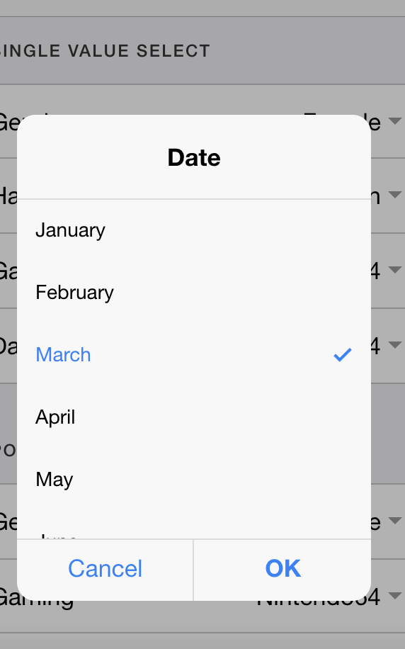

#标签
```
	<ion-nav>   root 导航
	<ion-header> 头
	<ion-navbar> 导航条
	<ion-footer> 尾
	ion-content  内容
	<ion-buttons> 多按钮
	<ion-button> <a button> 按钮
	<ion-toolbar>工具条
	<ion-title>  标题
	<tabs><tab> tabs
	<ion-searchbar>搜索
	ion-input  输入框
	ion-icon  图标
	ion-label 
	ion-list  列表 
	ion-      组头
	ion-      侧滑
	ion-item cell  <button ion-item>
	ion-toggle 开关
	ion-range  滚动条
	ion-radio 单选
	ion-checkbox 多选
	ion-select select
	ion-datatime 时间选择器
	ion-fabs    FAB
	ion-card  卡片
		ion-card-header
		ion-card-content
	ion-menu  侧栏
	ion-segment
		ion-segment-button
```
#服务

* 位置
	* start end    看文本布局方向
	* left right top bottom edge
* 文本
	* text-left 
	* text-right
	* text-center 
	* text-justify 
	* text-wrap
	* text-nowrap
	* text-uppercase text-lowercase text-capitalize
* 内容控制
	*  ShowWhen/HideWhen 显示 'ios' 'md'
	*  icon-left  图标在左
	*  icon-right
	*  icon-only
	*  item-left
	*  item-right
	*  range-left/right
* 功能
	*  menutoggle  / menuClose
	*  [navPush] =
	*  navPop
	*  [navParams] =
* 布局
	* float-left/right/start/end
	* padding / no-padding / padding-top/left/bottom/vertical/horizontal  16px
	* margin  16px
	* no-border 无边框


#组件
|名称|说明|展示|相关内容|
|----|------|--------|---|
|Header | Header |||
|||||
|Footer | Footer |||
|Action Sheets| ActionSheetController ||Alert|
|||||
|Alerts | AlertController |||
|||||
| Badges |ion-badge ||Badge|
||||
|Buttons| a/button ion-button || outline / round / block / full |
|||||
| Cards |卡片||ion-card-header/ion-card-content /外围 有间距|
|||||
| Checkbox |多选和使用在item|||
|||||
| DateTime |时间选择器|||
|||||
| FABs |ion-fab||ion-fab /ion-fab-list|
|||||
| Gestures |手势|| (tap)="xx"|
|||||
| Grid |  弹性布局 || ion-grid ion-row ion-col|
|||||
| Icons |  图标|| ion-grid ion-row ion-col|
|||||
| Inputs |  输入框||上下、左右、悬浮|
|||||
| list |  列表 || 侧滑 多选啊  |
|||||
| Loading |  加载中 || 消息提示、网络加载进度啊 IonicApp  _loadingPortal |
|||||
| Modals |  模态弹出 || IonicApp 的 _modalPortal上显示 |
|||||
| Popover | 小信息提示  || IonicApp 的 _overlayPortal上显示 |
|||||
| Radio | 单选  || ion-list |
|||||
| Range | 范围选择  ||  |
|||||
| Searchbar |  搜索 ion-searchbar  ||  |
|||||
| Segment |  Segment  ||  |
|||||
| Select |  类似标签select Select  || popver / 弹框 / Sheet 不同形式展示 |
|||||
| Slides | 图片轮播 || 图片轮播 / APP 引导页  |
|||||
| Tabs | Tabs/Tab 布局 || 基本布局  |
|||||
| Toast | 消息提示 ToastController || 顶部  中部 底部 消息提示  |
|||||
| Toggle |开关 ||  |
|||||
| Toolbar | 工具条 ||  |

<div class='text_zs'> Alerts </div>

<style>
	.text_zs{
		text-align:center
	}
	.img_zs{
		width:100px
	}
</style>
